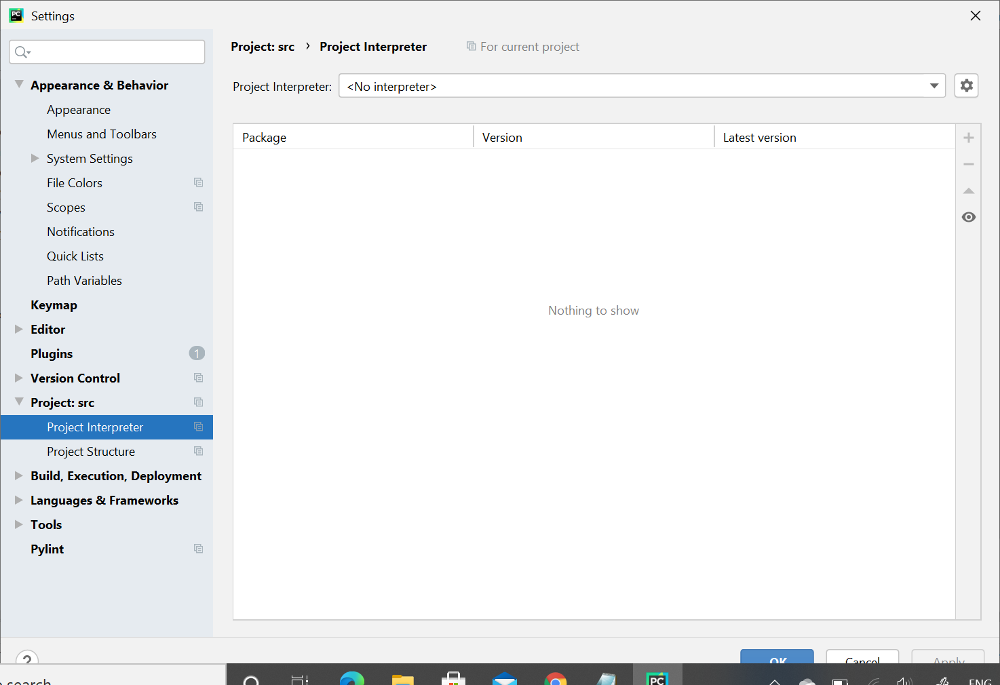
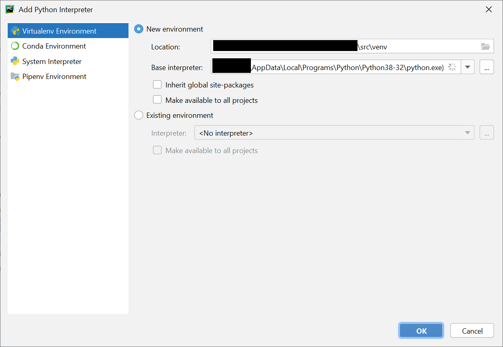
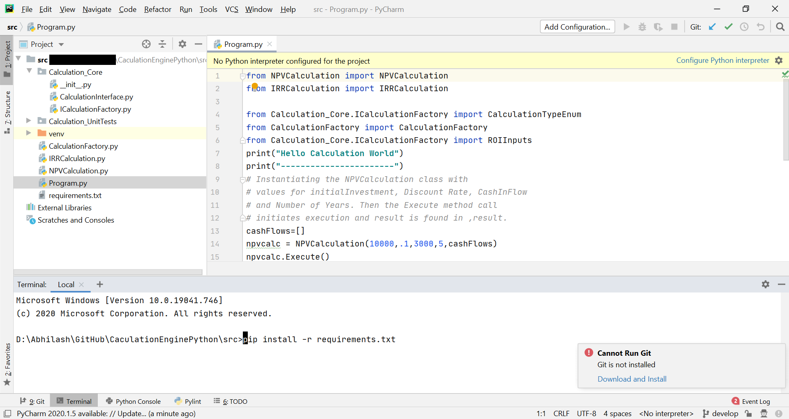

# Financial CalculationEngine in Python

## This project is a demonstrator of Factory Method Pattern
The project provides a Factory Method approach to integrate two calculations:  
1. NPV Calculation (Net Present Value)
2. IRR Calculation (Internal Rate of Return)

##Getting started with the Project in PyCharm

Pre-requisite: Python 3.6 or later installed and PyChram installed.  

1. Setup Environment

Go to File -> Settings - Project Interpreter. 
  

Click Add New and select the Virtual Environment option and Choose the runtime.  

2. Install Dependencies  

Now you can install the dependencies by opening Terminal (View-> Tool Windows-> Terminal)
In Terminal type pip install -r requirements.txt  

3. Run the Program  

Open the Program.py in IDE and press Run button to run the program.  
Alternatively you can run it by typing:  
python Program.py  
